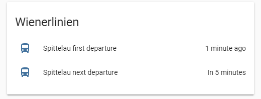

# Get information about next departures

A sensor platform which allows you to get information about next departure from specified stop.

To get started install this with [HACS](https://hacs.xyz/)

## Example configuration.yaml

```yaml
sensor:
  platform: wienerlinien
  firstnext: first
  stops:
    - '4429'
    - '3230'
```

## Configuration variables

key | description
-- | --
**platform (Required)** | The platform name.
**stops (Required)** | RBL stop ID's
**firstnext (Optional)** | `first` or `next` departure.

## Sample overview



## Notes

You can find out the Stop ID (rbl number) thanks to [Matthias Bendel](https://github.com/mabe-at) [https://till.mabe.at/rbl/](https://till.mabe.at/rbl/)


This platform is using the [Wienerlinien API](http://www.wienerlinien.at) API to get the information.
'Datenquelle: Stadt Wien – data.wien.gv.at'
Lizenz (CC BY 3.0 AT)

